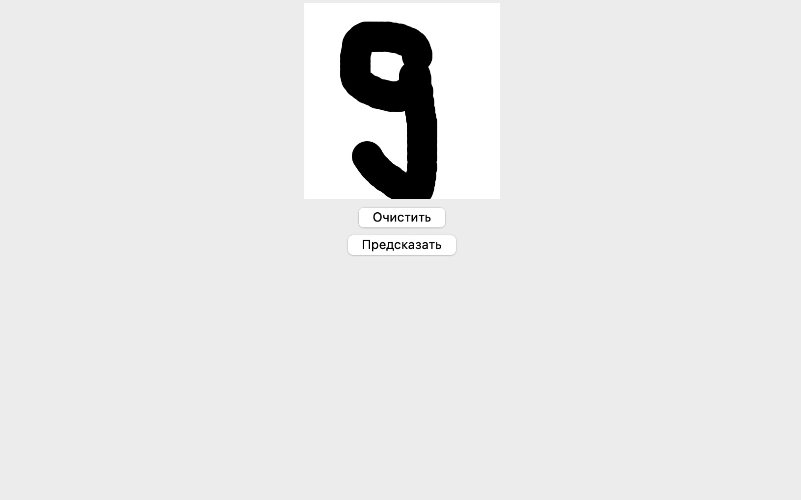
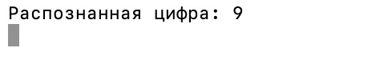

# Распознавание рукописных цифр

Это приложение использует сверточную нейронную сеть для распознавания рукописных цифр. Вы можете нарисовать цифру в приложении, после чего модель предскажет, какую цифру вы нарисовали.

---

## Оглавление
- [Особенности и технологии](#особенности-и-технологии)
- [Установка](#установка)
- [Как использовать обученную модель](#как-использовать-обученную-модель)
- [Использование](#использование)
- [Демонстрация](#демонстрация)
- [Лицензия](#лицензия)

---

## Особенности и технологии

### Особенности
- Используется модель (`mnist_model.h5`), обученная на наборе данных MNIST.
- Простой и интуитивно понятный графический интерфейс на основе Tkinter.
- Поддержка рисования, очистки экрана и получения предсказания.

### Технологии
- **Python**: основной язык разработки.
- **TensorFlow/Keras**: для построения и использования нейронной сети.
- **Tkinter**: для создания графического интерфейса пользователя.
- **Pillow**: для обработки изображений, нарисованных пользователем.
- **Scipy**: для обработки изображения и вычисления сдвига.

---

## Установка

1. **Клонируйте репозиторий:**
   ```bash
   git clone https://github.com/podushkina/mnist-cnn.git
   cd podushkina/mnist-cnn
   ```

2. **Установите зависимости:**
   Убедитесь, что Python версии 3.8 или выше установлен.
   ```bash
   pip install -r requirements.txt
   ```

---

## Как использовать обученную модель

В репозитории уже находится готовая обученная модель `mnist_model.h5`. Для её использования:

1. Убедитесь, что файл `mnist_model.h5` находится в корневой директории проекта (где расположен `model.py`).

2. В коде происходит загрузка модели с помощью следующей строки:
   ```python
   from tensorflow.keras.models import load_model
   model = load_model('mnist_model.h5')
   ```

3. Это позволяет сразу использовать модель без необходимости её повторного обучения.

---

## Использование

1. Запустите приложение:
   ```bash
   python model.py
   ```

2. С помощью мыши нарисуйте цифру на холсте в центре окна.

3. Нажмите кнопку **"Предсказать"**, чтобы получить результат в текстовом виде под холстом.

4. Если вы хотите нарисовать другую цифру, нажмите кнопку **"Очистить"**, чтобы очистить холст.

---

## Демонстрация

### Интерфейс приложения:
*На изображении показан графический интерфейс приложения. Вы можете нарисовать цифру с помощью мыши на холсте в центре окна и нажать кнопку "Предсказать" для получения результата.*


### Пример предсказания:
*На данном изображении видно, как приложение успешно распознало нарисованную цифру 9.*


---

## Лицензия

Этот проект лицензируется на условиях [MIT License](LICENSE).


